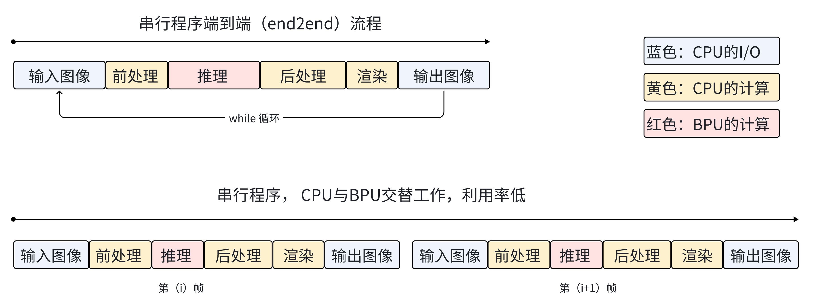
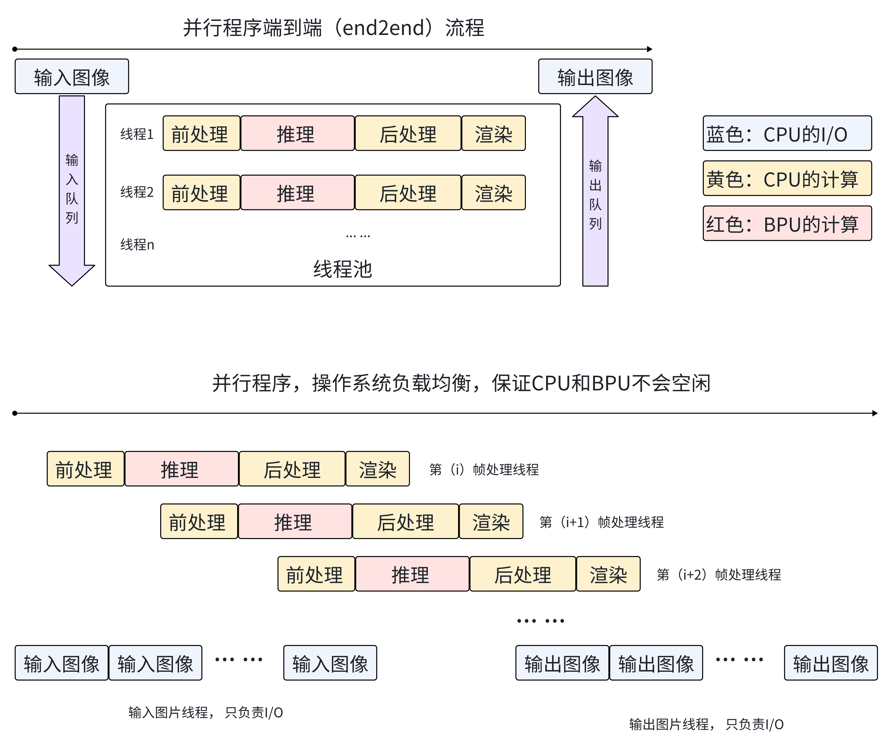
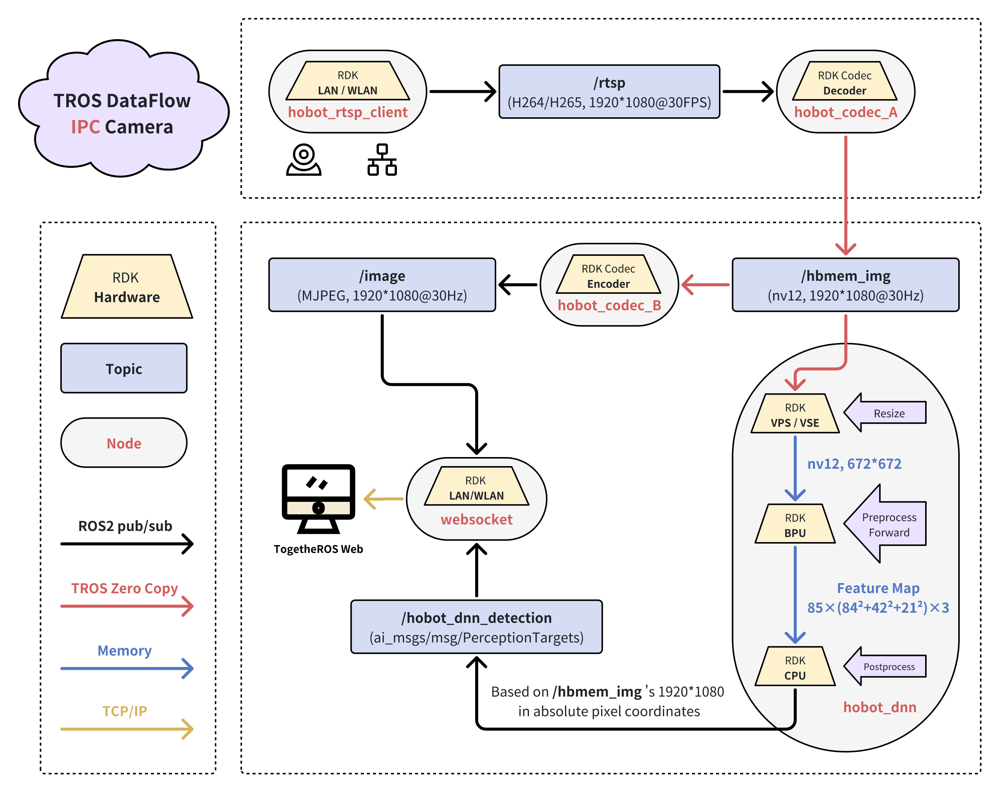
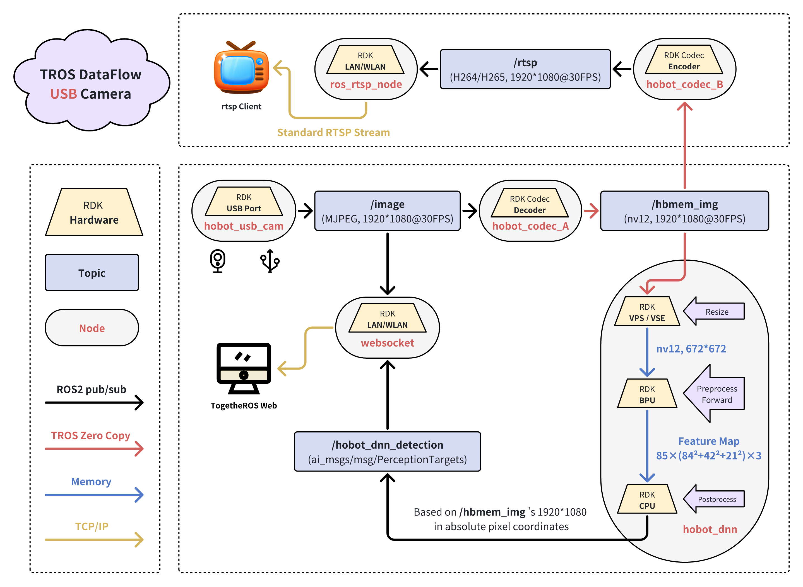
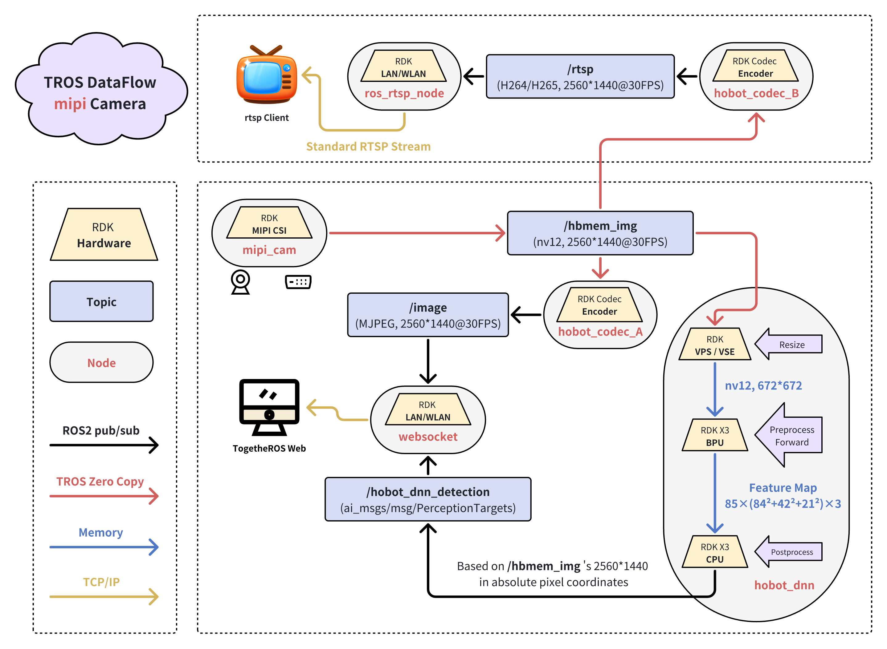

[English](./README.md) | 简体中文

# RDK Video Solution

在实时视频流推理中，RDK Video Solution主要优化了以下几方面:

 - 程序初始化和加载模型时间：在实时视频流推理的任务中，这些时间只需要消耗一次，不需要重复加载程序和模型。

 - 前处理时间：演示程序为了快速得到推理效果和尽可能大的兼容性，使用OpenCV准备nv12的输入数据，涉及到了比较冗余的色彩空间转换，导致了耗时长。实际量产中会使用更加高效的视频通路，使用JPU，VPU，Codec等硬件来准备输入数据，VPS/VSE等硬件来前处理，BPU来完成归一化等计算，这些都会比OpenCV快，且不消耗CPU。

 - 推理时间：实际量产中都会设计多线程和多进程等异步处理逻辑，而不是一个简单的while循环，只有多线程异步处理才会让CPU，BPU，JPU，VPU，Codec，VSE等硬件异步计算，同时工作。可以参考Model Zoo最新README将编译好的bin模型给TROS使用，只要摄像头帧率够，都可以跑满BPU的吞吐量。
  
 - 关于后处理：目前Python程序的nms使用的是cv2的接口，暂时没有替换为单个类别nms的接口，所以会出现召回率低的问题，建议使用C/C++的程序来测试精度。

 - 关于渲染，量产中，渲染是一个较低的需求，这部分一般不会在板卡运行。如果运行也会使用硬件OSD叠加，不会使用OpenCV。

## 串行程序设计和并行程序设计
### 串行程序设计

### 并行程序设计

## DataFlow参考

### IPC Camera (TROS DataFlow)

### USB Camera (TROS DataFlow)

### MIPI Camera (TROS DataFlow)
